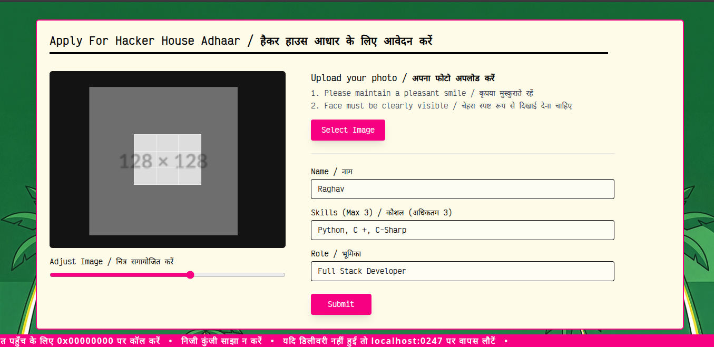
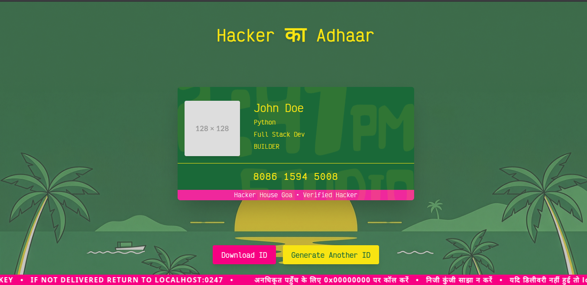

# Hacker Adhaar Generator

Hacker Adhaar Generator is a ID generator for hackers. This is built with respect to task requirements of [Hacker House Goa 2026, a hackathon in Goa, India].

The website features Indian aesthetics blended with hacker vibes.




## Features
 - Hacker House Goa 2026 Hackathon Themed
 - Tradition Indian Theme with Hacker Vibes
 - Download ID
 - Blazing Fast 
 - Mobile Optimised

## Stack

 - React
 - Vite
 - Tanstack (for navigation)

## Development

To edit this website or develop further. 

 - Clone the repo
 ```bash
 git clone https://github.com/Raghav67816/Hacker-ID-Generator.git
 ```

 - Install NPM packages
 ```bash
 npm install
 ```

 - Run
 ```bash
 npm run dev
 ```

## Directory Structure
```
src
 --- routes
    --- __root.jsx (tanstack root)
    --- card.jsx (the card component)
    --- index.jsx (the main landing page)

copImage.jsx (utility function to get cropped image data)
```

To configure, see `vite.config.js`. However, default configurations are enough.
